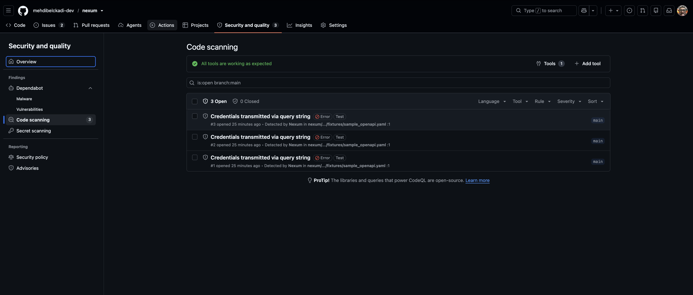

# nexum-scan action

[](https://github.com/mehdibelckadi-dev/nexum)

Scans your MCP server or OpenAPI spec for agentic security risks and uploads the
results as SARIF to your repository's **Security → Code scanning** tab.

## Prerequisites

The calling workflow must check out the Nexum repository before using this
action, as the install step runs `pip install -e .` from the working directory:

```yaml
- uses: actions/checkout@v5.0.0
- uses: ./.github/actions/nexum-scan
  with:
    spec-file: openapi.yaml
```

## Usage

Basic scan (fails the build on high-risk specs, uploads SARIF by default):

```yaml
- uses: mehdibelckadi-dev/nexum/.github/actions/nexum-scan@main
  with:
    spec-file: openapi.yaml
    fail-on-tier: '2'
```

### With SARIF upload and a baseline

To upload results to the Security tab and suppress consciously-accepted findings
via a [baseline file](../../../README.md), the job needs the
`security-events: write` permission:

```yaml
jobs:
  scan:
    runs-on: ubuntu-latest
    permissions:
      security-events: write   # required — without it upload-sarif fails with 403
      contents: read
    steps:
      - uses: actions/checkout@v5.0.0
      - uses: mehdibelckadi-dev/nexum/.github/actions/nexum-scan@main
        with:
          spec-file: openapi.yaml
          fail-on-tier: '2'
          upload-sarif: 'true'
          baseline-path: '.nexumbaseline.json'
```

## Inputs

| Input | Description | Required | Default |
|-------|-------------|----------|---------|
| `spec-file` | Path to OpenAPI or MCP spec file | Yes | — |
| `fail-on-tier` | Fail if risk tier >= this value (0–2) | No | `2` |
| `validate` | Run validator after scan (`true`/`false`) | No | `false` |
| `baseline-path` | Path to `.nexumbaseline.json` for suppressing known findings | No | `''` |
| `upload-sarif` | Upload SARIF results to the GitHub Security tab | No | `true` |

## Outputs

| Output | Description |
|--------|-------------|
| `risk-tier` | Risk tier (0=low, 1=moderate, 2=high) |
| `risk-score` | Aggregate risk score 0–100 |
| `findings-count` | Total findings |
| `sarif-path` | Path to the generated SARIF file |

## Security tab (SARIF upload)

When `upload-sarif: 'true'` (the default), the action generates a SARIF 2.1.0
report and uploads it with the official
[`github/codeql-action/upload-sarif@v3`](https://github.com/github/codeql-action)
under the category `nexum-agentic-risk`. Findings then appear in the repository's
**Security → Code scanning** tab.

Two things to know:

- The job **must** grant `permissions: security-events: write`. Without it, the
  upload fails with a `403`.
- The upload step runs with `always()`, so the SARIF is uploaded **even when the
  scan fails** on `fail-on-tier`. A blocked PR still surfaces its findings in the
  Security tab — the block and the report are independent.

Nexum's findings on the Security tab, from the self-scan of this repository:



## Validate behaviour

When `validate: true`, the action runs `nexum validate` against the manifest
and blocks **only** on `DO_NOT_DISTRIBUTE` (exit code 1). A `REVIEW_REQUIRED`
result (exit code 2) is logged but does not fail the step.
